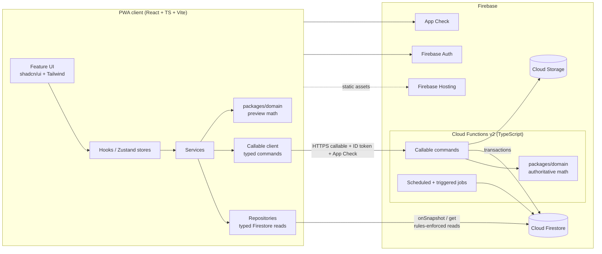
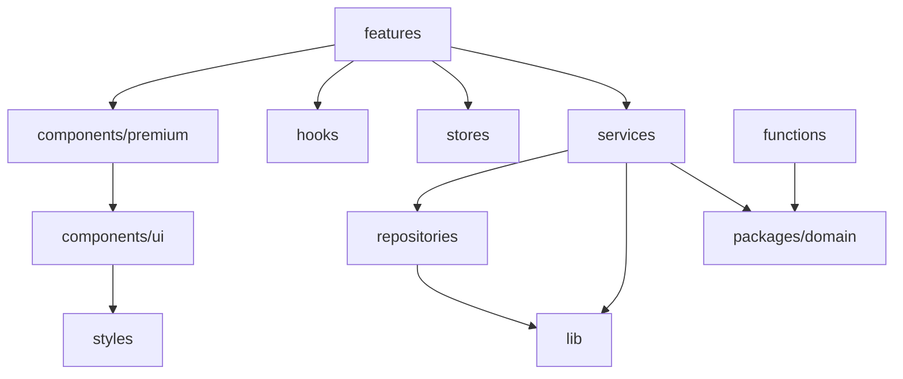
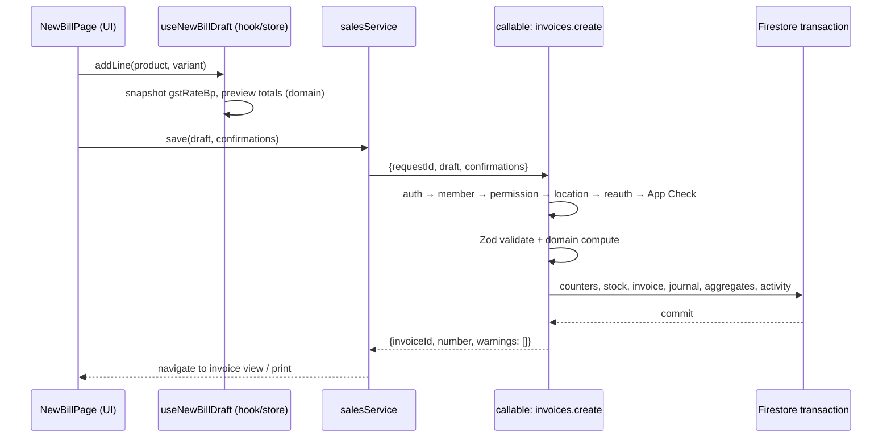
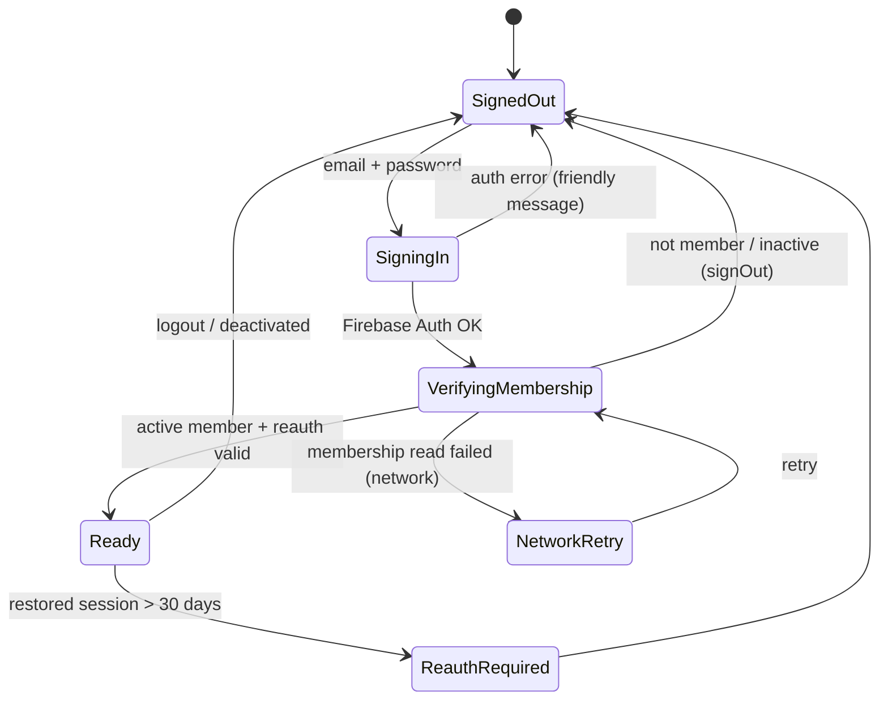
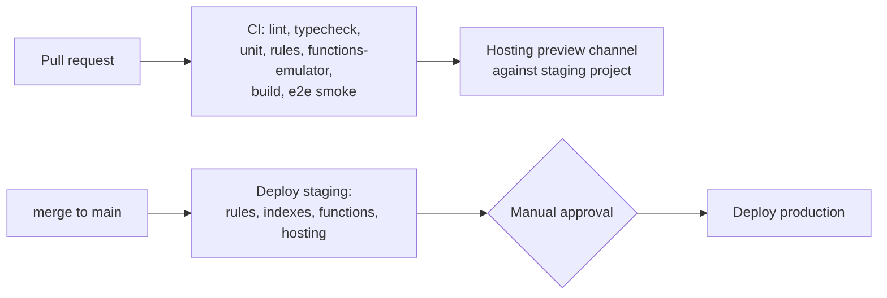

# Architecture

> **Phase 0 deliverable.** The target architecture for the Hynish ERP rebuild. It replaces the legacy single-file, `innerHTML`-rendered, client-authoritative SPA with whole-document sync (TD §1, §2, §7). Legacy business behavior is preserved as specified in `LEGACY-COMPATIBILITY.md` and `BUSINESS-RULES.md`.

---

## 1. System overview



**Core rule:** the client **reads** (rules-enforced, realtime where useful) and **requests commands**. Cloud Functions **decide and write** everything that affects numbering, stock, money, accounting, permissions or audit.

---

## 2. Repository structure

npm workspaces monorepo. Workspaces are a package-manager feature, not a framework. They are justified because the GST, money, numbering and accounting logic must exist exactly **once** and run on both server and client (spec §23).

```
hynish/
├─ apps/
│  └─ web/                       React PWA
│     ├─ index.html
│     ├─ public/                 icons, manifest assets
│     └─ src/
│        ├─ app/                 bootstrap, providers, router, layouts, error boundaries
│        ├─ components/
│        │  ├─ ui/               shadcn/ui primitives (generated, token-driven)
│        │  └─ premium/          MetricCard, GradientCard, PageHeader, DataList, MoneyText…
│        ├─ features/
│        │  ├─ auth/ dashboard/ products/ inventory/ locations/ customers/ suppliers/
│        │  ├─ sales/ purchases/ quotations/ delivery-notes/ credit-notes/ debit-notes/
│        │  ├─ payments/ accounting/ expenses/ payroll/ reports/ gst/ admin/ settings/
│        │  └─ <feature>/{components,hooks,routes.tsx,index.ts}
│        ├─ hooks/               cross-feature hooks (useMediaQuery, useOnline, useHotkeys)
│        ├─ lib/                 firebase init, callable client, formatters, errors
│        ├─ services/            orchestration per domain (client side)
│        ├─ repositories/        typed Firestore readers (+ converters)
│        ├─ stores/              Zustand stores (session, ui, drafts)
│        ├─ schemas/             form schemas (extend packages/domain schemas)
│        ├─ types/               UI-only types
│        ├─ config/              env, nav config, feature flags, constants re-exports
│        └─ styles/              tokens.css, globals.css
├─ functions/                    Cloud Functions v2
│  └─ src/
│     ├─ index.ts                exports only
│     ├─ commands/<domain>/*.ts  one file per callable
│     ├─ services/               ledger, stock, numbering, payments, audit, backup
│     ├─ repositories/           admin-SDK typed data access
│     ├─ auth/                   context → Actor, permission guard, location guard, reauth guard
│     ├─ jobs/                   scheduled verification, backups, TTL cleanup
│     └─ lib/                    errors, logger, idempotency, transaction helpers
├─ packages/
│  └─ domain/                    pure TypeScript, zero Firebase imports
│     └─ src/{money,gst,numbering,fy,stock,barcode,accounting,dues,reorder,words,permissions,constants,schemas}/
├─ tools/migration/              legacy → new migration CLI (MIGRATION-PLAN)
├─ firestore.rules  storage.rules  firestore.indexes.json  firebase.json  .firebaserc
├─ tests/rules/                  @firebase/rules-unit-testing suites
├─ e2e/                          Playwright suites (incl. responsive viewports)
├─ .github/workflows/            CI/CD
└─ docs/                         this contract
```

**Dependency direction** (enforced by ESLint `import/no-restricted-paths`):



- `features/*` **must not** import `firebase/firestore` (spec §18). A lint rule enforces this.
- A feature must not import another feature's internals. It imports only from `features/<x>/index.ts`.
- `packages/domain` must not import anything from Firebase, React or the DOM.

---

## 3. Frontend architecture

| Concern | Choice |
|---|---|
| Framework | React 19 + TypeScript (`strict`, `noUncheckedIndexedAccess`, `exactOptionalPropertyTypes`) |
| Build | Vite |
| Styling | Tailwind CSS with CSS-variable design tokens (UI-UX-SYSTEM) |
| Components | shadcn/ui (Radix primitives), Lucide React icons, Manrope font |
| Routing | React Router (data routers, lazy route modules per feature) |
| Forms | React Hook Form + Zod resolver. Form schemas extend domain schemas. |
| Tables | TanStack Table (desktop). The same column model renders a card list on mobile. |
| Charts | Recharts via theme-aware wrappers |
| Dates | date-fns (+ `date-fns-tz` pending approval, OQ-13) for business-timezone math |
| State | Zustand (client/UI state) + Firestore listeners (server state), see §4 |

### 3.1 Feature module anatomy

```
features/sales/
  routes.tsx                 lazy routes: /sales, /sales/new, /sales/:id, /sales/:id/edit
  components/                NewBillPage, CartLines, TotalsBar, CustomerPicker, …
  hooks/                     useInvoice(id), useInvoicesList(filters), useNewBillDraft()
  index.ts                   public surface
```
Services and repositories for a domain live in `src/services/sales.service.ts` and `src/repositories/invoices.repo.ts` so that several features can share them (for example, dues uses the invoices repository).

### 3.2 Routing and access

- Each route declares `requires: Permission[]` in `config/nav.ts`. A `RouteGuard` checks the session store, redirects or shows a 403 page, and sets the active nav item. This mirrors the legacy `setTab()` behavior (LC-50.7).
- The navigation structure (groups, labels, order) lives in one config file, filtered through `can()`. Empty groups are dropped (legacy parity).
- Guards are UX only. Authorization is enforced by the server (SECURITY-ARCHITECTURE).

---

## 4. State management

| State kind | Where | Examples |
|---|---|---|
| Session | `stores/session.store.ts` (Zustand) | user, member, business, permissions, working location, reauth status |
| UI | `stores/ui.store.ts` (Zustand, persisted per device) | sidebar collapsed groups, theme preference cache, table density, last report filters |
| Drafts | `stores/drafts/*.store.ts` (Zustand, persisted per device and user in IndexedDB) | New Bill draft, purchase draft, quotation/DN/CN/DBN/transfer/count drafts (LC-50.9) |
| Server data | Repository subscriptions exposed through hooks (`useLiveQuery`) with a small cache keyed by query | invoices list, products, stock levels, settings |
| Derived | pure functions from `packages/domain` inside `useMemo` | draft totals preview, low-stock flags, dues badges |

Rules:
- Server data is **not** copied into Zustand stores (that would recreate the legacy global-state problem). Hooks return `{data, status, error}`.
- Drafts hold *intent only*: line product/variant/qty/rate/discount and the snapshotted GST rate. Totals in drafts are previews. The server recomputes them.
- Draft persistence is cleared on sign-out and when switching business.

---

## 5. Repository and service pattern



- **Repositories** (`repositories/*.repo.ts`) are the only client code that imports `firebase/firestore`. They expose typed functions such as `watchInvoices(filters, cb)`, `getInvoice(id)` and `watchStockLevels(locationId, cb)`. They use `FirestoreDataConverter`s that validate with Zod in development and map `Timestamp` values.
- **Services** (`services/*.service.ts`) orchestrate. They call repositories for reads, call `callable<Cmd>()` for writes, and map errors to user messages.
- **Callable client** (`lib/callable.ts`) is typed from a shared `commands` contract in `packages/domain/src/commands.ts` (request and response Zod schemas per command). This gives one contract for both sides.
- **Two-phase confirmation:** commands that have legacy "confirm to override" semantics (stock shortage, credit limit, overpayment, negative adjustment) return `{status:'needs_confirmation', warnings:[…]}` without writing anything. The UI shows the same confirmation the legacy app showed and re-submits with `confirmations: ['STOCK_SHORTAGE', …]`. The server re-validates at commit time.

---

## 6. Cloud Functions architecture

### 6.1 Runtime

- Cloud Functions **v2**, Node 22, TypeScript. Region is co-located with Firestore (recommended `asia-south1`, OQ-15).
- `onCall` callables with `enforceAppCheck: true` and `consumeAppCheckToken: true` for money/stock commands (replay protection).
- `minInstances: 1` for the billing-critical functions (`invoices.create`) in production to avoid cold starts at the counter. Everything else scales to zero.

### 6.2 Command catalogue (initial)

| Domain | Commands |
|---|---|
| settings | `settings.updateBusiness`, `settings.updateNumbering`, `settings.updateIntegrations`, `settings.uploadLogo` (signed flow) |
| members | `members.upsert`, `members.setActive`, `members.setPermissions` (owner/admin; OQ-02) |
| locations | `locations.save`, `locations.archive` |
| products | `products.save`, `products.quickAdd`, `products.archive`, `products.setImage` |
| inventory | `stock.adjust`, `transfers.create`, `stockCounts.apply` |
| customers/suppliers | `customers.quickAdd`, `customers.archive`, `suppliers.archive` (plain create/edit is a rules-validated direct write) |
| sales | `invoices.create`, `invoices.update`, `invoices.delete` |
| quotations | `quotations.create`, `quotations.update`, `quotations.delete` |
| delivery notes | `deliveryNotes.create`, `deliveryNotes.update`, `deliveryNotes.markReturned`, `deliveryNotes.delete` |
| credit/debit notes | `creditNotes.create`, `creditNotes.delete`, `debitNotes.create`, `debitNotes.delete` |
| purchases | `purchases.create`, `purchases.update`, `purchases.delete` |
| payments | `payments.record` |
| accounting | `accounts.create`, `accounts.archive`, `expenseCategories.create`, `expenseCategories.archive` |
| expenses/cash | `expenses.save`, `expenses.delete`, `cash.save`, `cash.delete` |
| payroll | `payroll.save`, `payroll.delete`, `staff.save`, `staff.archive`, `staffPayments.save`, `staffPayments.delete` |
| reports | `reports.trialBalance`, `reports.profitLoss`, `reports.balanceSheet`, `reports.generalLedger`, `reports.shopComparison`, `reports.gstFiling`, `reports.salesReport`, `reports.reorder` |
| admin | `backup.create`, `restore.prepare`, `restore.execute`, `admin.resetAllData`, `activity.logSession` |

### 6.3 Command pipeline

Every command goes through the same middleware chain (`functions/src/lib/command.ts`):

```mermaid
flowchart LR
  A[Callable request] --> B[App Check verified]
  B --> C[Auth token present<br/>+ reauth age check]
  C --> D[Load Member<br/>active?]
  D --> E[Permission check<br/>can(actor, perm)]
  E --> F[Location check<br/>actor may act at locationId]
  F --> G[Zod validate payload]
  G --> H[Idempotency check<br/>requestId]
  H --> I[Domain compute<br/>packages/domain]
  I --> J[runTransaction:<br/>re-read state, validate,<br/>write all effects]
  J --> K[Activity log in same tx]
  K --> L[Typed result / typed error]
```

- **Transactions:** every multi-document effect is one `runTransaction`: number reservation, stock levels, movements, document, journal entries, ledger buckets, aggregates and activity log. Either all of it commits or none of it does.
- **Large documents:** when an operation would exceed 500 writes (see DATA-MODEL §9), the service splits it into ordered transactions under an `operations/{opId}` lock document with a resumable cursor. This is used only for very large stock counts and restores.
- **Idempotency:** the client generates a `requestId` (UUID v4) once per user action. The server stores `idempotency/{requestId}` inside the same transaction and returns the original result on retry. This makes a double-tapped **Save** or a network retry safe. Records expire through a Firestore TTL policy after 7 days.
- **Optimistic concurrency:** update commands carry `expectedRevision`. A mismatch returns `CONFLICT` ("This bill was changed on another device. Reload?"). This mitigates legacy KL-08.

### 6.4 Reports

Reports are callables that read journal/ledger buckets or aggregates on the server and return typed DTOs. P&L and Balance Sheet use `ledgerMonthly` buckets for complete months plus a range query for partial months. Nothing is cached as authoritative. This matches the legacy "computed live" semantics (LC-29.3).

### 6.5 Triggers and scheduled jobs

| Job | Purpose |
|---|---|
| `onMemberWrite` (Firestore trigger) | keep `users/{uid}.businessIds` in sync; revoke refresh tokens when a member is deactivated |
| `nightlyIntegrityCheck` (scheduled, 02:00 IST) | recompute stock levels from movements, ledger buckets from journal, customer outstanding from invoices; alert on drift |
| `scheduledBackup` (daily, optional per OQ-20) | server-side backup to Storage with a retention policy |
| TTL policies | `idempotency.expireAt` |

---

## 7. Firestore structure

Defined in `DATA-MODEL.md §4`. Summary:

- `businesses/{businessId}` is the tenant root. All data lives in its subcollections.
- Header-plus-embedded-lines documents for transactional records.
- Server-only collections (stock, journal, documents, counters, activity) are read-only to clients through rules.
- Master data with low risk (customer and supplier create/edit, staff directory, WhatsApp drafts) may be written directly by the client. Rules validate the fields and forbid server-owned ones.

---

## 8. Realtime data

### 8.1 Listener policy

| Data | Mechanism | Scope |
|---|---|---|
| Business settings, locations, own member doc | `onSnapshot` (always on while signed in) | single docs / small collections |
| Products (master) | `onSnapshot`, active only | full collection (bounded catalogue) |
| Customers, suppliers | `onSnapshot`, active only | full collection; paged if > 5 000 (then search tokens) |
| Stock levels | `onSnapshot` for the **working location** | `where(locationId == current)` |
| Invoices / DNs / quotations lists | `onSnapshot`, paged by date | current page only |
| Open document (bill view/edit) | `onSnapshot` on that doc | conflict banner on remote change |
| Stock movements, journal, activity log | paged `getDocs` (no listener) | avoid the legacy "download the entire ledger" problem (KL-07) |
| Reports | callable on demand | n/a |

The legacy per-collection "Realtime X Sync" toggles and their merge strategies (blind replace, diff-and-push, additive, max-merge) are **not** reproduced. Server-authoritative writes make them unnecessary (LC-43.1).

### 8.2 Listener lifecycle

Listeners are owned by hooks and unsubscribe on unmount. Session-wide listeners (settings, locations, member) are owned by a `SessionDataProvider` that starts after the membership is verified and stops on sign-out. This replaces the legacy `reconnectRealtimeSyncOnLogin()` and `retryEnableOnFirstConnect()` logic.

### 8.3 Membership changes at runtime

The session listens to its own member doc. On `active:false`, a role change or a location change, the session store updates immediately. If the member is deactivated, the user is signed out with an explanation.

### 8.4 Search

Legacy search was an in-memory case-insensitive substring match (BR-RPT-08). The new approach:
- Products, customers and suppliers are already in memory through their listeners, so client-side substring search gives exact legacy semantics.
- Invoices, quotations and purchases: search by number prefix and customer name through `searchTokens` (lower-cased prefixes of words and of the number). Pure substring search over all historical documents is not practical in Firestore. This is a documented, accepted semantic narrowing for historical documents only. If it proves insufficient, an in-memory index for the last N months can be added later.

---

## 9. Authentication



- A single auth state machine in `stores/session.store.ts` removes the legacy concurrent sign-in race by construction (LC-3.5).
- `lastInteractiveSignInAt` is recorded server-side by `activity.logSession` after an interactive sign-in. Callables verify `auth_time` from the ID token against the 30-day window (BR-PRM-08).
- Firebase Auth persistence is `browserLocalPersistence` (legacy parity: sessions survive restarts until the 30-day re-auth).
- No public sign-up. Member provisioning is OQ-02.

---

## 10. Authorization

See `SECURITY-ARCHITECTURE.md`. Summary:
- The permission model lives in `packages/domain/permissions`: roles → permission sets, plus per-member overrides (the legacy `tabs`).
- Every callable runs `requirePermission` and `requireLocation`.
- Firestore rules mirror the read permissions and deny every write to server-owned collections.
- The UI calls `can(permission)` from the same package, so UI and server never disagree.

---

## 11. PWA

See `PWA-ARCHITECTURE.md`. Summary: web app manifest, Workbox-generated service worker that precaches only the hashed app shell, never intercepts cross-origin or Firebase traffic (legacy fix preserved), a user-prompted update flow, and install UX for Android and iOS.

---

## 12. Caching

| Layer | Policy |
|---|---|
| Static assets | Hashed file names, `Cache-Control: public, max-age=31536000, immutable`; SW precache |
| `index.html`, `sw.js`, `manifest.webmanifest` | `no-cache` (legacy parity, LC-44.3) |
| Firestore data | Default **memory cache**. Persistent IndexedDB cache is an opt-in "trusted device" mode, pending OQ-04. Cleared on sign-out. |
| Callable responses | never cached |
| Images | Storage download URLs cached by the browser HTTP cache; not precached |

---

## 13. Error handling

- **Typed errors:** functions throw `HttpsError` with a stable `details.code` from `packages/domain/errors.ts` (`VALIDATION_FAILED`, `NEEDS_CONFIRMATION`, `PERMISSION_DENIED`, `LOCATION_DENIED`, `REAUTH_REQUIRED`, `CONFLICT`, `NUMBER_TAKEN`, `UNBALANCED_JOURNAL`, `NOT_FOUND`, `INTERNAL`). Validation errors carry field paths so React Hook Form can show them on the right field.
- **Friendly messages:** `lib/errors.ts` maps codes and Firebase SDK errors to shop-owner-friendly text. This keeps the intent of the legacy `friendlyFirebaseError`, including the network/hotspot hint.
- **UI:** a route-level `ErrorBoundary` per feature. Toasts for recoverable errors. Inline errors for form fields. The confirmation dialog handles `NEEDS_CONFIRMATION`.
- **No silent failure:** every caught error is either shown to the user or logged. Legacy "swallow and retry" patterns are not ported.

## 14. Logging and audit

| Stream | Tool |
|---|---|
| Business audit | `activityLog` (server-written, immutable), and the in-app Activity Log screen |
| Function logs | `firebase-functions/logger` structured JSON with `businessId`, `uid`, `requestId`, `command`, `durationMs`. No PII beyond ids. |
| Client errors | a `clientErrors` callable (rate-limited) → Cloud Logging. No third-party SDK (tech contract). |
| Integrity alerts | the nightly job writes `integrityReports/{date}` and logs at `ERROR` → Cloud Monitoring alert policy |

## 15. Testing strategy

| Level | Tooling | Scope |
|---|---|---|
| Domain unit | Vitest | every `BR-*` rule has a test named with its id; golden tests from legacy formulas (GST, round-off, FY, words, barcode, reorder) |
| Component | Vitest + Testing Library | premium components, forms, and theme rendering in both modes |
| Rules | `@firebase/rules-unit-testing` + emulator | allow/deny matrix per role × collection × location |
| Functions integration | Vitest + Firestore/Auth emulators | every command: happy path, each validation, idempotency, concurrency (parallel invoice creation → unique numbers), stock and journal invariants |
| E2E | Playwright (pre-installed Chromium) | key workflows on the 8 required viewports (UI-UX §12), light and dark, PWA installability audit |
| Legacy parity | Vitest fixtures from legacy backup JSON | migrate → recompute TB, P&L, dues, stock → compare with the legacy values (MIGRATION-PLAN §8) |

Vitest, Testing Library and Playwright are dev-only test tooling. They are not runtime frameworks (listed in OQ-13 for approval).

## 16. Deployment



- Three Firebase projects: `hynish-dev` (emulators and dev), `hynish-staging`, `hynish-prod` (names are placeholders; OQ-15).
- GitHub Actions authenticates with Workload Identity Federation (no long-lived JSON keys).
- Rules and indexes are deployed by CI only (the legacy app pasted rules by hand, LC-2.6).
- **Single version source:** the root `package.json` version is injected at build time into the web app (`import.meta.env.APP_VERSION`), the SW cache id, backups and functions. This fixes legacy KL-19.

## 17. Offline behavior (pending OQ-04)

The legacy app was fully offline-first. The new architecture makes numbering, stock and accounting server-authoritative. Until OQ-04 is decided:
- Reads work from the cache while offline if persistent cache is enabled on the device.
- Commands require connectivity. The UI shows a clear offline state, keeps the draft (persisted), and enables **Save** when connectivity returns.
- Nothing is queued to auto-submit later without the user seeing it.

## 18. Phase roadmap (proposed)

| Phase | Scope |
|---|---|
| 1 | Monorepo scaffold, tooling, CI, design system and theme, app shell (nav, layouts, responsive), auth + membership + permission core, PWA shell, emulator setup, `packages/domain` money/GST/FY/numbering with tests |
| 2 | Settings (business, numbering, bank), locations, members, products/variants/barcodes, stock levels + movements + adjustments |
| 3 | Customers, suppliers, New Bill + invoices (create/edit/delete), payments, dues, invoice PDF |
| 4 | Quotations, delivery notes, credit/debit notes, purchases, transfers, stock counts, reorder |
| 5 | Accounting (CoA, journal, statements, GL), expenses, cash book, payroll/staff |
| 6 | Reports, dashboard, GST filing + exports, activity log, backup/restore, reset |
| 7 | Migration tooling + dry runs + parity verification, cutover |

Every phase ends with a **LEGACY COMPATIBILITY CHECK** section (template in `CLAUDE.md`).

---

## 19. Phase 2 addendum — Firebase & Cloud Functions foundation

The Firebase/Functions architecture from §6 is now scaffolded and exercised end-to-end against
the emulator suite.

### 19.1 Workspaces

```
packages/domain   pure logic (money, GST, numbering, permissions) — built to dist for reuse
apps/web          React PWA (aliases @hynish/domain to src for dev)
functions         Cloud Functions v2 (TypeScript, NodeNext ESM) — consumes @hynish/domain dist
```

The root scripts build `packages/domain` before typecheck/build/test so `functions` (which
imports the built package) always resolves it.

### 19.2 Cloud Functions layout (implemented)

```
functions/src/
├── index.ts                 exports only
├── config/{app,constants}.ts  Admin SDK init (app) + pure constants (unit-test-safe)
├── utils/{errors,logger}.ts   typed AppError codes; secret-free audit logging
├── auth/
│   ├── types.ts             MemberRecord, TokenFacts, Actor
│   ├── authorize.ts         PURE composable guards (permission/location/reauth/step-up/owner)
│   ├── context.ts           resolveActor() — Firestore-backed trusted context
│   └── session.ts           logSession callable (login/logout audit + profile upsert)
├── middleware/callable.ts   defineCallable(): region + App Check + Zod + typed errors
├── members/
│   ├── manage.ts            createMember / updateMember / setMemberActive callables
│   └── triggers.ts          onMemberWritten (businessIds sync + token revocation)
└── schemas/members.ts       Zod request schemas
```

The callable pipeline (`defineCallable` → `resolveActor` → `assert*`) is the reusable pattern
every future business-operation function will follow (ARCHITECTURE §6.3).

### 19.3 Client auth architecture (implemented)

- One authoritative store, `apps/web/src/stores/auth-store.ts`, driving the whole app: Firebase
  `onAuthStateChanged` → membership `onSnapshot` → resolved `AuthStatus`. Business data
  listeners (locations, settings) start only when authorized.
- `AuthGate` (`app/auth-gate.tsx`) renders login / unauthorized / inactive / config-error
  screens and only mounts the shell + routed pages when status is `ready`, so protected content
  never flashes before authorization (§48).
- Context hooks (`features/auth/hooks.ts`): `useAuth`, `useBusiness`, `useMembership`,
  `usePermission(s)`, `useCurrentLocation`. UI gates: `PermissionGate`, `RoleGate`.

### 19.4 Testing (implemented)

| Suite | Runner | Count |
|---|---|---|
| Domain (money, FY, permissions) | Vitest | 10 |
| Web (auth store, permission-filtered nav, shell, components, utils) | Vitest + jsdom | 23 |
| Functions authorization guards | Vitest | 11 |
| Firestore rules | Vitest + Firestore emulator | 20 |
| Storage rules | Vitest + Storage emulator | 10 |

`npm run test` runs the unit suites; `npm run test:rules` runs the emulator security suites.

---

## 20. Phase 3 addendum — domain, infrastructure & services layering

```
UI (features/components)
  → hooks / stores            (Zustand: UI + session only, never the DB)
    → services                (apps/web/src/services: orchestration, pure calc, callable wrappers)
      → repositories          (apps/web/src/infrastructure/repositories: typed reads + realtime)
        → Firebase            (converter-validated; writes = Cloud Functions)
packages/domain               (pure: money, dates, GST, numbering, accounting, inventory,
                               errors, query, schemas, fixtures — zero Firebase/React/DOM)
```

- **No Firestore in the UI** is enforced by ESLint (`no-restricted-imports` on `firebase/firestore`
  and the firestore infra/lib modules within `features/**` and `components/**`).
- **Repositories** are read/realtime only this phase (`get`/`list` cursor-paginated/`watch`);
  every critical write is a server-authoritative Cloud Function.
- **`packages/domain`** is the single home for business logic shared by the web client and Cloud
  Functions, so the client, the server and (mirrored) the Firestore rules never disagree.
- **`reserveDocumentNumber`** is the first server-authoritative operation; `postJournal`,
  `recordStockMovement`, `postInvoice/Purchase/Payment` have their contracts in `@hynish/domain`
  and land with their modules.

## Phase 4 — Master data flow (implemented)

- **UI → Hooks → Service → Callable → Firestore.** React components never touch Firestore/Storage
  directly (ESLint-enforced). Reads go through the Phase 3 repositories (`use-paged-list`,
  `use-entity`); writes go through `services/masterdata.service.ts`, the single write path, which
  calls the `functions/src/masterdata/*` callables.
- **Server-authoritative callables** — `saveProduct`/`setProductActive`/`setProductImage`,
  `saveCustomer`/`setCustomerActive`, `saveSupplier`/`setSupplierActive`,
  `saveLocation`/`setLocationActive` — each runs App Check + auth + Zod, then
  `resolveActor` → `assertPermission` → (locations excepted, which are managed by an unrestricted
  role) location/business isolation, then a transactional/batched write + audit.
- **Pure business logic** stays in `packages/domain` (`gst-states.ts`, `text.ts`) so client, server
  and rules agree; product invariants live in `functions/src/masterdata/validation.ts` (unit-tested,
  firebase-admin-free).
- **Location locking (Phase 5 dependency):** locations are soft-deleted, never removed, and the
  "one active location" invariant is server-enforced, so a later phase can safely lock a session to a
  location and rely on it continuing to exist and resolve.

## Phase 5 — Sales flow (implemented)

- **UI → hooks → sales.service → callable → transaction → Firestore.** Components never touch
  Firestore/Storage directly. Reads go through the repositories; writes go through
  `services/sales.service.ts` → `finalizeInvoice`/`deleteInvoice`/`recordPayment`/`saveQuotation`.
- **One deterministic calculator** (`computeCart` in `packages/domain/gst.ts`) powers the live UI
  preview, the server recompute, and the tests — the client preview is never authoritative (§22/§23).
- **The accounting gateway** (`functions/src/accounting/post-core.ts`) is the single writer of journal
  entries (balance-or-refuse; void-and-repost). Numbering (`reserveNumberInTx`) and idempotency run in
  the same transaction as the invoice/payment write, so numbering + document + journals are atomic.
- **Integration boundary for Phase 6:** finalize/delete are the transactions where stock movements
  will be added; lines already carry baseQty/unitCost/skipStockDeduction. The `payment_out` /
  purchase path is stubbed in the domain for the Purchases phase.

## Phase 6 — Inventory & purchases flow (implemented)

- **Ledger-first stock:** `functions/src/inventory/stock-core.ts::applyMovementTx` writes an immutable
  movement AND the derived stockLevel in one transaction; the balance is never mutated without a
  movement (BR-STK-02/03). `readLevelTx` (read phase) → `applyMovementTx` (write phase).
- **Purchase → stock-in:** `finalizePurchase` recomputes the total (no GST), records `purchase`
  movements, updates base-unit `purchasePrice` (BR-PUR-05), posts Dr Inventory / Cr Cash / Cr AP.
- **Sale → stock-out:** `finalizeInvoice` writes `sale` movements with a shortage warning + override,
  edit reverses then reapplies, delete restores — all inside the existing sales transaction.
- **Inventory ops** (adjust / transfer / count / opening) are server-authoritative, atomic,
  idempotent callables over the same core; UI → service → callable → transaction → Firestore.
- **Valuation:** none invented — COGS uses the purchasePrice snapshot (BR-COGS-01/02).

## Phase 7 — Accounting, ledger & financial statements flow (implemented)

- **One posting gateway:** `functions/src/accounting/post-core.ts::postJournalTx` remains the ONLY
  place a journal entry is written — Sales, Purchases and (new) Cash Book/Accounts management all
  reuse it or stay entirely off the journal by design (§53 no duplicate accounting logic). No React
  component posts journals directly; there is no generic manual-journal-entry callable.
- **accountIds derivation:** `postJournalTx` now also stores the distinct `accountIds` referenced by
  an entry's lines, letting the General Ledger query `journalEntries` by
  `accountIds array-contains {id}` and letting `deleteAccount` refuse deletion of a referenced
  account — without a second denormalized "account usage" table.
- **Chart of Accounts:** `seedChartOfAccounts` is the first writer of the 14 default `Account`
  documents (idempotent, per-doc existence check); `saveAccount` creates custom accounts
  (duplicate-name rejection, auto-code); `deleteAccount` refuses system accounts and
  referenced accounts.
- **Cash Book** (`accounting/cash-book.ts::logCashEntry`) is a parallel, deliberately unconnected
  ledger — it never calls `postJournalTx` (BR-CASH-02, TD §6.3).
- **Financial statements are read-only aggregations**, not new persisted structures: General Ledger,
  Trial Balance, P&L, Balance Sheet, Receivables and Payables all recompute from `journalEntries`
  (+ `invoices`/`purchases`) client-side via `useLedgerAggregate` — a bounded (5000-entry-capped),
  cursor-paginated full fetch that surfaces a `truncated` flag rather than silently either
  downloading an unbounded history or under-reporting the books.
- **Deliberately not built (§65 do-not-invent):** a generic manual-journal-entry UI/callable and a
  generic `reverseJournal` callable — TD §6.1 states the business user never touches a
  debit/credit screen directly except in the Chart of Accounts itself; reversal only happens via
  the existing Sales/Purchases void-then-repost edit/delete flows (BR-ACC-05).

## Phase 8 — Business Operations flow (implemented)

- **Expenses** reuse the exact reverse-then-repost pattern already established for invoices/
  purchases: `saveExpense` always voids the prior posted journal entry for the expense (a no-op on
  create) then posts a fresh one via `journalLinesForExpense` — never an in-place accounting
  adjustment (TD §6.4). `seedExpenseCategories` mirrors `seedChartOfAccounts` exactly: idempotent,
  creates only what's missing, auto-generates each category's linked expense account.
- **Delivery Notes** reuse the invoice's stock-movement pattern (undo-then-reapply on edit) but
  post NO accounting entry at all (BR-DN-09) — a DN is purely a stock + document event. Converting
  a pending DN to an invoice reuses the EXISTING `finalizeInvoice({source:{type:'delivery_note'}})`
  path built in Phase 5 (unchanged); this phase only adds the DN's own create/edit/mark-returned
  side.
- **Credit Notes and Debit Notes are the source's entire return mechanism** — there is no separate
  "Sales Return"/"Purchase Return" document type (§68, do not invent). Both reuse
  `postJournalTx`/`applyMovementTx` exactly as every other module does (§53 no duplicate accounting
  logic): a Credit Note's quantity is clamped server-side via `clampEligibleQty` against every
  prior Credit Note on the same invoice line, computed from a fresh Firestore read inside the same
  transaction — never trusting a client-supplied "remaining eligible" figure. A Debit Note mirrors
  this exactly against a purchase.
- **No Bank Operations / Cash-Bank transfer module exists.** The source has no fund-transfer
  feature between Cash and Bank — `cashOrBankAccountId()` (Phase 5) already routes every non-Cash
  payment mode to a single Bank account, and that remains the entire "bank" surface of this system
  (see `docs/OPEN-QUESTIONS.md`).
- **Single-purpose callables, not extracted cores:** `saveExpense`, `saveDeliveryNote`,
  `saveCreditNote`, `saveDebitNote` each own their own transaction inline, matching the codebase's
  established convention that only logic reused by multiple callers (`post-core.ts`,
  `stock-core.ts`, `reserve-core.ts`) gets extracted into a shared module — none of these four is
  called from anywhere but its own UI form.

## Phase 9 — Reports, Analytics & Dashboard flow (implemented)

Reports are strictly read-only and follow one flow throughout: **UI page → report hook (a bounded
`useLedgerAggregate` fetch, Phase 7) → pure calculation in `packages/domain/src/reports.ts` → render.**
No report page imports Firestore or a repository directly (unchanged rule); no report recomputes a
number a Cloud Function already computed and stored (GST totals, invoice totals, journal balances are
always read, never re-derived).

- **One aggregation hook, reused everywhere.** `useLedgerAggregate` (built in Phase 7 for the General
  Ledger/Trial Balance/P&L) is the aggregation primitive for every new report: Dashboard, Sales
  Reports, Shop Comparison, GST Filing, Dues, Payables, the Expense/Cash trend additions, and the
  Wastage KPI all call it directly instead of each report inventing its own fetch-everything loop.
  Each page issues 1–3 bounded fetches (never a fetch per KPI), and where two pages need the exact
  same figure they share the same hook or the same already-fetched array rather than duplicating the
  query: `useOutstandingInvoiceSource()` backs both the Dashboard's Outstanding Dues card and the
  Dues page; `useOutstandingPurchaseSource()` mirrors it for Payables; Cash Book's new KPIs/trend/
  category table reuse the page's existing `entries` fetch with no new query at all.
- **Independent widget failure.** Each Dashboard KPI/section computes from its own bounded fetch and
  renders its own loading/error/empty state (`TrendChart`, `RecentInvoicesTable`, `LowStockTable`),
  so one failed or slow widget never blocks or crashes the rest of the dashboard.
- **Bounded, not realtime.** No report page uses an `onSnapshot` listener; every fetch is a bounded,
  capped, manually-refreshable query (`useLedgerAggregate`'s `LEDGER_FETCH_CAP = 5000`, or a smaller
  page-specific limit), consistent with §33's "avoid aggressive realtime listeners" instruction.
- **Charts never calculate.** The shared `TrendChart` component (`components/charts/trend-chart.tsx`)
  is a pure renderer: it takes precomputed `{key, label, value}` points from a report's `bucketByPeriod`
  call and never touches raw documents itself. It reuses the app's existing dual-themed `--chart-1..6`
  CSS tokens (no new palette) and offers a Chart/Table toggle for accessibility.
- **Location scoping matches the source.** Sales Reports, Expense Report, Cash Report, and the
  Wastage KPI are scoped to the *working* location (TD §3.7/§6.3/§6.4/§4.3); Dashboard KPIs, Dues,
  Payables, Shop Comparison, and GST Filing aggregate *all* locations (TD §3.1/§6.5/§6.8/§3.5) —
  each page's query filters (or deliberately omits) `locationId` to match, never left to client-side
  guessing.
- **CSV export is client-side only.** `downloadCSV()` (`lib/csv.ts`) builds a CSV from data the
  caller already holds in memory (already gated by the page's own permission and location scoping);
  no server round-trip, no new callable, matching the TD's `downloadB2BCsv`-style client export.
- **Deliberately not built** (§65/§68, source-grounded): a standalone Purchase Reports screen (not
  documented as a distinct screen — Purchases already has its own filterable list, Phase 6), a Bank
  Report/reconciliation screen (no Bank Operations module exists at all, Phase 8), a separate
  "Sales by Location" report (folded into Shop Comparison's per-location `sales` column), a new
  Account Statement page (Phase 7's General Ledger already is the per-account date/ref/debit/credit/
  running-balance statement), and any generic SaaS metric not in the TD (LTV, CAC, MRR, ARR, churn).
