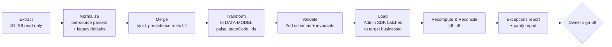

# Migration Plan

> **Phase 0 deliverable.** How legacy v2.86.1 data will eventually move into the new data model (`DATA-MODEL.md`). **No migration is performed in Phase 0**, and nothing in this plan writes to or deletes legacy data. The migration is built in the final phase (ARCHITECTURE §18, phase 7) and rehearsed repeatedly against copies before cutover.

---

## 1. Principles

1. **Non-destructive.** The legacy Firebase project (`hh-erp-2026`) and every device's local data are **read only**. The legacy app keeps working until sign-off.
2. **Separate target.** Data is loaded into the **new** Firebase project (staging first, then production) under a new `businessId`. Nothing is written into the legacy project.
3. **Deterministic and idempotent.** The same inputs produce the same outputs. Legacy ids are preserved. A run can be wiped and repeated.
4. **Verify by recomputation.** After loading, the new server services recompute stock, dues, Trial Balance, P&L and GST totals, and the results are compared with the legacy values (§8).
5. **Nothing silently dropped.** Every record is either migrated, merged (with a reason) or listed in the exceptions report for the owner to decide.

## 2. Legacy data sources

| # | Source | Contents | Notes |
|---|---|---|---|
| S1 | Firestore `businesses/hh-erp-2026/data/main` | Every interval-synced collection (TD §7.2): products, customers, invoices (GST only), suppliers, purchases, stockMovements, physicalCounts, quotations, deliveryNotes, creditNotes, debitNotes, expenses, expenseCategories, locations, transfers, cashEntries, whatsappCampaigns, accounts, journalEntries, payrollEntries, staffMembers, staffPayments, activityLog, and `settings` | May contain resurrected or stale records (KL-02) |
| S2 | Firestore realtime collections | `customers`, `suppliers`, `products`, `invoices`, `stockMovements`, `locations` | Fresher than S1 for these collections when their realtime flag was on |
| S3 | Firestore `settings/main` | Syncable business settings + counters | Counters were max-merged (TD §7.4) |
| S4 | Firestore `members/{uid}` | role, active, locationName, tabs | Plus Firebase Auth users (export through the Admin SDK) |
| S5 | Firebase Storage `productImages/*` | product photos | Some photos are base64 inside S1/S6 instead |
| S6 | **Per-device backup JSON** (`wholesale-ledger-backup-<date>.json`) | Every slice on that device, **including Without-GST invoices**, `productImages`, local-only settings (theme, whatsapp) | **Required**: Without-GST invoices never reached Firestore (TD §5.3). Each device that ever billed must export a backup. |

**Required action before migration:** export a legacy backup (Settings → Backup) from **every device** (each shop and admin device), and record which device and location it came from. Devices that are no longer in use but hold Without-GST bills must be recovered, or their loss explicitly accepted by the owner.

## 3. Pipeline

Implemented as `tools/migration` (a Node + TypeScript CLI that reuses `packages/domain` schemas and calculators). It is run as `migrate extract | plan | load | verify` with a `--run-id`.

## 4. Merge and precedence rules

| Situation | Rule |
|---|---|
| Same id in S2 and S1 (a collection that has a realtime path) | Take the S2 record. Log the difference if they differ. |
| Id in S1 but not in S2 (for a realtime collection) | Possible deletion that S1 resurrected, **or** a record never pushed. Put it in the exceptions report as `ORPHAN_IN_WHOLE_DOC`. Default: **include** it (keeps data, legacy "local wins" semantics), with the owner reviewing it. |
| Same id in several device backups (S6) | Take the record whose content hash matches S1/S2. Otherwise take the one with the latest `updatedAt`/`createdAt` if present, else the latest backup file. Log it. |
| Without-GST invoices (S6 only) | Union across devices by id. **Duplicate NGST numbers across devices are expected**, because the NGST counters were per-device and never synced. See §9 and OQ-27. |
| Locations | Fixed seed ids (`loc-baby-step`, `loc-cool-kids`, `loc-quency-culture`, `loc-hynish-wh`) collapse naturally. Name duplicates with different ids go in the report. |
| Expense categories / accounts | Deterministic ids (`exp-cat-*`, `acc-*`) collapse naturally. |
| Stock movements | Union by id (additive, legacy parity). |

## 5. Field mapping

### 5.1 Settings → `settings/business`, `counters`

| Legacy | New | Transform |
|---|---|---|
| `businessName, address, city, pincode, phone, email` | same names | trim |
| `gstin` | `gstin` | trim + uppercase |
| `state` (name) | `stateCode` | name → code via the GST state table; unmatched → derive from GSTIN; else null + report |
| `businessLogo` (base64) | `logoPath` | upload to Storage `branding/logo.jpg` |
| `licenseKey` | `licenseKey` | copy (OQ-26) |
| `bankName, bankAccount, bankIfsc` | `bank.{bankName, accountNumber, ifsc}` | trim |
| `invoicePrefix`, `invoicePrefixNoGst`, `quotePrefix`, `dnPrefix`, `cnPrefix`, `dbnPrefix` | `prefixes.{invoice_gst, invoice_nogst, quotation, delivery_note, credit_note, debit_note}` | blank → default (DEF-013) |
| `nextInvoiceSeq` … `nextDbnSeq` | `counters/{series}.nextSeq` | `max(S3 value, S1 value, every S6 value, highest used seq + 1)` per series (FY handling per OQ-03) |
| `theme` | `users/{uid}.preferences.theme` for the device's account | copy if present |
| `whatsapp.*` (except apiKey) | `settings/integrations.whatsapp` | copy; `apiKey` → Secret Manager **only if the owner confirms**, never into Firestore |
| `firebase.*` | — | dropped (per-device config, superseded) |

### 5.2 Members

| Legacy | New | Transform |
|---|---|---|
| `members/{uid}` | `members/{uid}` | same uid (Auth accounts carried over, §5.12) |
| `role` | `role` | `owner` / `admin` / `shop` unchanged. Any other value → `shop` + report. |
| `active` | `active` | copy |
| `locationName` | `locationIds` | case- and whitespace-insensitive match to location names. Match → `[id]`. **No match → `[]` (fail closed) + report**, unlike legacy's fail-open. Admins → `null`. |
| `tabs` | `permissionOverrides` | tab key → permission(s) mapping table (built from the legacy `TOGGLEABLE_TABS`, OQ-10) |

### 5.3 Locations

`{id, name, type, address, openingCashBalance, isDefault}` → same, with `openingCashBalancePaise = toPaise(openingCashBalance)` and ids preserved.

### 5.4 Products, variants, stock

| Legacy | New |
|---|---|
| `id, name, category, hsn, unit, barcode` | same (barcode trimmed and uppercased; uniqueness conflicts → report) |
| `wholesalePrice`, `purchasePrice` | `wholesalePricePaise`, `purchasePricePaise` |
| `gstRate` | `gstRateBp` (must be in the allowed list; otherwise report) |
| `lowStockThreshold` | `lowStockThreshold` (0/blank → null) |
| `altUnits` | `altUnits` (validated per BR-PRD-01) |
| `hasVariants, variants[{id,size,color}]` | same ids |
| legacy flat `stock` (pre-variants) | synthetic variant `default` (TD §2.7 migration) |
| `variants[].stockByLocation{loc:qty}` | `stockLevels/{productId}__{variantId}__{loc}.qty` |
| `productImages[id]` base64 | upload → `products/{id}/{imageId}.jpg`, `imagePath` |
| `productImages[id]` https URL | copy the object from the legacy bucket → new path |

### 5.5 Customers and suppliers

`{id, name, contactPerson, gstin, state, city, phone, address, creditLimit}` → same, with `stateCode` (name → code; blank stays null, **preserving intra-state behavior**, BR-GST-01), `creditLimitPaise`, recomputed `stats`, `nameLower` and `searchTokens`.

### 5.6 Invoices

| Legacy | New |
|---|---|
| `id` | `id` |
| `invoiceNo` | `number`; parse `PREFIX/FY/SEQ` → `seriesKey`, `fy`, `seq`. Unparseable → report, keep the string. |
| `gstApplicable` (missing → true) | `gstApplicable` (DEF-019) |
| `date, dueDate, notes, locationId` | same (missing `locationId` → first location + report) |
| `customerId`, `customerSnapshot` | same; snapshot state → code |
| `items[]` | `lines[]`: `gstRate → gstRateBp`, `rate → ratePaise`, `discountPct → discountBp`, `baseQty = toBaseQty`, **stored tax amounts preserved** (see §6), `unitCostPaise` from the matching `invoice_cogs` journal (Σcost / Σqty) or else the product's current purchase price + report |
| `skipStockDeduction` | same |
| totals, `roundOff`, `grandTotal` | `*Paise`; the legacy stored values are kept as authoritative |
| `paidAmount`, `payments[]` | `paidPaise`; each payment → a `payments` doc; `initialPaidPaise = paidAmount − Σpayments` (never negative; else report) |
| `status` | recomputed `paymentStatus` (BR-PAY-02); mismatch → report |
| `createdByUsername` | `createdByName`; `createdBy` = mapped uid when resolvable, else `legacy:<username>` |
| source quote/DN link | `source` |

### 5.7 Quotations, DNs, CNs, DBNs, purchases, transfers, physical counts

Same pattern: ids preserved, money → paise, rates → bp, states → codes, statuses copied (`open/converted`, `pending/invoiced/returned`), `restock` copied, purchase `payments[]` → `payments` docs. `physicalCounts` → `stockCounts`. `transfers` → `stockTransfers`.

### 5.8 Stock movements

Copied 1:1 (ids, types, qtyChange, locationId, refs, reason category, notes). `qtyAfter` is recomputed during replay (§7). Unknown types → report.

### 5.9 Accounting

| Legacy | New |
|---|---|
| `accounts` | same ids, codes, types, `isSystem`, `expenseCategoryId` |
| `journalEntries` `{id,date,locationId,refType,refId,refLabel,lines,createdAt}` | same, with `status:'posted'` and lines in paise. Imbalance after conversion (the legacy 0.01 tolerance) → put the residual paise on the largest line of the same side, and log it. Any residual > 1 paise → report and do not load that entry until reviewed. |
| — | `ledgerMonthly` rebuilt from the journal |

### 5.10 Expenses, cash, payroll, staff

| Legacy | New |
|---|---|
| `expenses` | same + `amountPaise`, `categoryNameSnapshot = categoryName`; missing `locationId` → first location (DEF-032) |
| `expenseCategories` | same ids + `accountId` |
| `cashEntries` | same + `amountPaise`, `source: {type:'manual'}` unless linkable |
| `payrollEntries.userId` | **`locationId`** (TD §6.6) |
| `staffMembers` / `staffPayments` | `staff` / `staffPayments` |

### 5.11 Activity log and WhatsApp drafts

`activityLog` → `activityLog`, keeping the action code, `userId → actorUid` (if resolvable) and `username → actorName`. `whatsappCampaigns` → same.

### 5.12 Auth accounts

Firebase Auth users are exported from the legacy project and imported into the new one with `auth:import`, including password hashes (scrypt parameters from the legacy project). Uids are preserved, so members map 1:1. Users sign in with their existing passwords. The first sign-in in the new app counts as an interactive sign-in (it starts the 30-day window).

## 6. Money conversion and reconciliation

- `toPaise(x) = Math.round(x × 100)` (half away from zero for negatives). This is applied to every stored legacy money field.
- **Stored document values are authoritative for historical documents.** Invoices already printed or filed must keep the amounts that were printed. After conversion the migration **recomputes** each document with the new engine and compares:
  - |difference| ≤ 1 paise per line or total → accept the stored values and log `ROUNDING_DRIFT`.
  - Otherwise → `RECALC_MISMATCH` in the report. The stored values are still kept (history is never rewritten).
- Per-customer outstanding, invoice totals by month and GST totals by month are compared between the legacy and new calculations (§8).

## 7. Stock reconciliation

1. `stockLevels` come from the merged current `stockByLocation` (the legacy source of truth for current stock).
2. Movements are replayed per (product, variant, location) to get `Σ qtyChange`.
3. Where `Σ movements ≠ current stock` (possible in legacy: the ledger was never enforced to reconcile, some older data predates movements, and resurrected records exist), a `migration_opening` movement dated at cutover bridges the difference, with note `Migration reconciliation (legacy run <id>)`. Every bridge is listed in the report.
4. After this, `stockLevels.qty = Σ movements` holds for every key (DATA-MODEL §7 invariant).

## 8. Parity verification (acceptance)

| Check | Legacy value | New value | Tolerance |
|---|---|---|---|
| Trial Balance per account (all time) | computed from the legacy journal (floats) | new ledger | ≤ 1 paise × number of entries touching the account |
| Trial Balance totals balanced | — | exact | 0 |
| P&L per month (last 24 months) | legacy calc | `reports.profitLoss` | ≤ ₹1 |
| Balance Sheet at cutover | legacy calc | `reports.balanceSheet` | ≤ ₹1 |
| Customer outstanding (each) | `customerOutstandingBalance` | `stats.outstandingPaise` | ≤ 1 paise |
| GST Filing per month: B2B, B2C, CDNR, HSN totals | legacy `renderGst` aggregation | `reports.gstFiling` | exact against stored per-invoice tax |
| Stock per (product, variant, location) | `stockByLocation` | `stockLevels` | exact |
| Document counts per collection | merged sources | loaded | exact (minus reported exclusions) |
| Counters | per §5.1 | `counters` | exact |

The legacy calculations are ported as **reference implementations** into `tools/migration/legacy-calc/`, copied from the legacy source (which must be made available; OQ-11). They run over the same merged input.

## 9. Numbering continuity

- Counters: §5.1. The next number issued after cutover is higher than every legacy number in that series.
- **Duplicate legacy numbers** (a known consequence of KL-01, and certain for NGST across devices): both documents are kept with their original number strings. The first by `createdAt` gets the reservation key. Later ones get reservation keys suffixed `__dup<n>` and a `legacyDuplicateNumber: true` flag, and are listed in the report. **How duplicates are presented or renumbered requires a decision** (OQ-27). Renumbering already-issued GST invoices is not done by default.

## 10. Risks

| Risk | Impact | Mitigation |
|---|---|---|
| Without-GST invoices exist only on devices | Permanent loss of those bills if a device isn't exported | Mandatory per-device backup collection (§2); a sign-off checklist that lists every device |
| Resurrected or deleted records in `data/main` | Wrong customers/products/locations reappear | `ORPHAN_IN_WHOLE_DOC` report, owner review |
| Duplicate invoice numbers | Audit and GST confusion | §9 + OQ-27 |
| Float → paise drift | Balance mismatches | §6 rules, residual handling for the journal, parity report |
| Stock ledger doesn't reconcile | Bridge movements needed | §7, fully reported |
| Journal entries referencing missing accounts or documents | Unbalanced or orphaned books | Report; accounts auto-created as `acc-legacy-<id>` only with owner approval |
| State names that don't map to codes | Wrong tax type on **new** bills for that customer | Report; fix before cutover; blank stays intra (legacy parity) |
| Member `locationName` mismatch | The user has no access after cutover (fail closed) | Report + fix the mapping before cutover |
| Legacy source code unavailable | Can't port reference calculations or confirm NOT VERIFIED details | OQ-11: obtain the legacy repository and `CHANGELOG.md` |
| Firestore 1 MiB `data/main` near its limit | Truncated reads are impossible, but the export may be large | Stream parse; the S6 backups cover the same data |
| Password hash import parameters | Users can't sign in | Test `auth:import` in staging with a test account first |
| Data entered in legacy during the cutover window | Missing records | Freeze window (§12) |

## 11. Versioning

- Every loaded document gets `schemaVersion: 1` and an optional `legacyRef: { source: 'S1'|'S2'|'S6:<device>', legacyId, runId }`, which is kept for traceability.
- The migration tool is versioned and each run records `runId`, the tool version, a SHA-256 of every input file and document set, and counts. Outputs are stored in `migrationRuns/{runId}` (target project, server only) and as report files.
- Future schema changes use the same `schemaVersion` transforms that restore uses (BR-BAK-03), so a legacy backup can also be imported later through the restore path.

## 12. Validation

1. **Schema:** every transformed record passes the `packages/domain` Zod schema. Failures go to the report, and the record is not loaded.
2. **Referential:** every `customerId`, `productId`/`variantId`, `locationId`, `accountId`, `refId` and `source.id` resolves or is reported.
3. **Invariants:** journal balance per entry, stock = Σ movements, invoice paid = initial + Σ payments, counters above every used seq.
4. **Parity:** §8.
5. **Business review:** the owner reviews the exceptions report and the parity report, spot-checks 20 random invoices (the PDF from legacy vs the new view), and checks each location's stock and the cash balance.

## 13. Cutover runbook (outline)

1. Rehearsal runs on staging until the reports are clean or every item is accepted.
2. Announce a freeze window. All devices stop billing in legacy.
3. Export a backup from every device (§2). Collect S1–S5.
4. Run the migration into **production** (a new project). Verify (§8). Owner sign-off.
5. Switch users to the new app URL. The old URL shows a notice (Hosting redirect) after sign-off.
6. Keep the legacy project **read only** (tighten its rules to deny writes, which is reversible) for the rollback window.

## 14. Rollback strategy

| Stage | Rollback |
|---|---|
| Before sign-off | Discard the target (`migrate wipe --business <id>` deletes only the new business tree in the new project). Legacy is untouched and keeps running. |
| After cutover, within the rollback window (proposed 14 days) | Re-open legacy writes (revert its rules). Data entered in the new app during the window is exported with the new backup and re-entered or imported into legacy manually. This is documented as costly, so sign-off must be thorough. |
| After the window | Legacy stays archived read-only (not deleted) for audit. The legacy backups and the migration reports are retained. |

At no point is legacy data deleted by the migration.

## Phase 4 — Master data readiness (implemented)

- The importer targets the Phase 4 collections directly: `products` (with derived `nameLower`,
  `searchTokens`, normalized `barcode`, and a `barcodes/{code}` index entry per non-empty barcode),
  `customers`/`suppliers` (GSTIN upper-cased, `stateCode` derived), and `locations`.
- **Categories** need no migration — they are free-text `products.category` values surfaced as a
  derived view, exactly as in legacy.
- Barcode uniqueness is enforced on import via the same transactional index the app uses; duplicate
  legacy barcodes surface as import conflicts rather than silent overwrites.
- **Location locking (Phase 5):** because locations are soft-deleted and one active location is always
  guaranteed, migration can seed locations first and later phases can lock to them safely.

## Phase 5 — Sales readiness (implemented)

- Invoices/quotations/payments import into the Phase 5 collections with server-shaped fields (frozen
  snapshots, seriesKey, integer-paise totals, `paymentStatus`, revision). Numbering counters seed the
  `counters` docs so imported numbers and future numbers never collide (KL-01 fixed).
- Journal entries are reconstructable from the same `journalLinesFor*` builders the runtime uses, so
  migrated books reconcile to legacy `postJournal()` output.
- Phase-6 dependency: stock movements for historical invoices are seeded by the Inventory migration;
  Phase 5 invoices already carry `baseQty`/`unitCostPaise`/`skipStockDeduction` for that step.

## Phase 6 — Inventory & purchases readiness (implemented)

- Historical stock is seeded as `migration_opening` / `opening` movements so every balance has
  history; the derived `stockLevels` are written in the same transaction (never a silent balance).
- Purchases import with the supplier's bill number (no generated series) and re-run the same
  `journalLinesForPurchase` builder, so migrated books reconcile to legacy `journalLinesForPurchase`.
- Product `purchasePrice` (the COGS cost basis, BR-COGS-02/BR-PUR-05) migrates on the product; no
  valuation recomputation is performed (§63).

## Phase 7 — Accounting readiness (implemented)

- The Chart of Accounts is seeded once (`seedChartOfAccounts`) before any journal-producing
  migration runs, so migrated `migration_opening` entries (already supported by
  `JOURNAL_REF_TYPES`) reference real `Account` documents from the start — no dangling accountIds.
- Migrated journal entries keep the exact legacy account ids (`acc-cash`, `acc-sales`, …), so
  historical books reconcile line-for-line against the source without an id-remapping step.
- Financial statements (Trial Balance/P&L/Balance Sheet) are computed live from `journalEntries`,
  so migrated history is visible in them immediately with no separate statement-migration step.
- Cash Book entries migrate as `source: {type: 'manual', id: null}` rows (or with a real source id
  when traceable) — they never need a corresponding journal entry, since the source never posted
  them either (BR-CASH-02).
