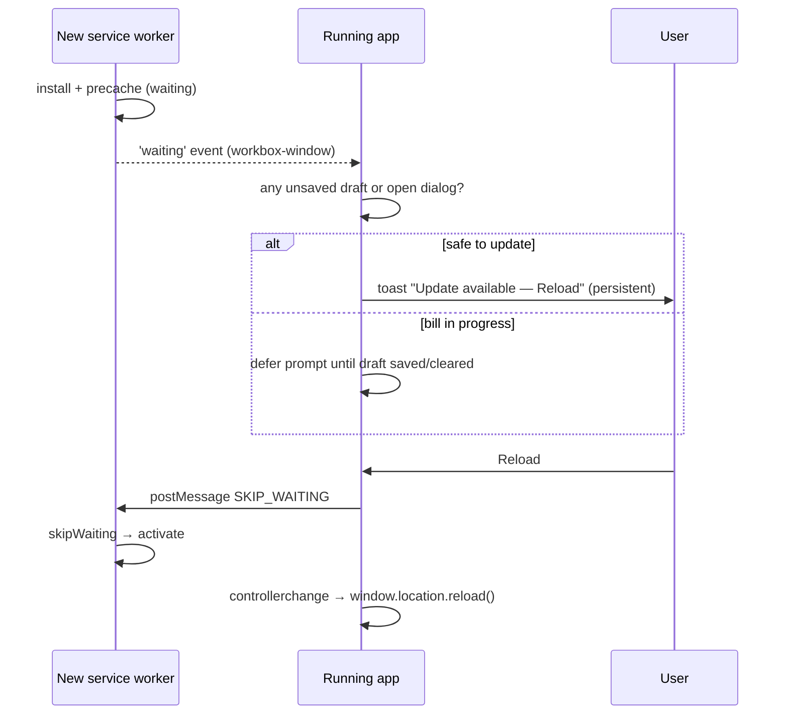

# PWA Architecture

> **Phase 0 deliverable.** How the rebuilt app is installable and resilient as a Progressive Web App on Android Chrome, iOS Safari (Add to Home Screen) and desktop Chromium, **without** weakening Firebase security. It preserves the legacy PWA safety fixes (TD §8.1): same-origin-only interception, no HTML substituted for failed non-navigation requests, and no-cache on the files that control caching.

---

## 1. Goals and non-goals

| Goals | Non-goals |
|---|---|
| Installable (Android, iOS, desktop), standalone window | Caching business data in the service worker |
| Instant app-shell start, offline shell | Offline command queue (pending OQ-04) |
| Safe, user-controlled updates that never interrupt a bill in progress | Push notifications (not in legacy, LC-45.4) |
| Correct safe-area handling on notched devices | Background sync of writes |
| Single version source for app + SW (fix KL-19) | Electron packaging (OQ-16) |

## 2. Web App Manifest (`manifest.webmanifest`)

```json
{
  "id": "/",
  "name": "Hynish Clothing — Wholesale Ledger",
  "short_name": "Hynish ERP",
  "description": "Billing, inventory, GST and accounting for Hynish Clothing.",
  "start_url": "/?source=pwa",
  "scope": "/",
  "display": "standalone",
  "display_override": ["window-controls-overlay", "standalone"],
  "orientation": "any",
  "background_color": "#0F1626",
  "theme_color": "#172033",
  "categories": ["business", "finance", "productivity"],
  "icons": [
    { "src": "/icons/icon-192.png", "sizes": "192x192", "type": "image/png", "purpose": "any" },
    { "src": "/icons/icon-512.png", "sizes": "512x512", "type": "image/png", "purpose": "any" },
    { "src": "/icons/maskable-192.png", "sizes": "192x192", "type": "image/png", "purpose": "maskable" },
    { "src": "/icons/maskable-512.png", "sizes": "512x512", "type": "image/png", "purpose": "maskable" }
  ],
  "shortcuts": [
    { "name": "New Bill", "url": "/sales/new?source=shortcut", "icons": [{ "src": "/icons/shortcut-bill.png", "sizes": "96x96" }] },
    { "name": "Stock", "url": "/inventory?source=shortcut" },
    { "name": "Dues", "url": "/dues?source=shortcut" }
  ],
  "screenshots": [
    { "src": "/screenshots/mobile-dashboard.png", "sizes": "1080x2340", "type": "image/png", "form_factor": "narrow" },
    { "src": "/screenshots/desktop-dashboard.png", "sizes": "1920x1080", "type": "image/png", "form_factor": "wide" }
  ]
}
```

- Standalone display and the 192/512 icons are preserved from legacy (DEF-071). `background_color`/`theme_color` keep the legacy dark navy for the splash screen. The runtime `<meta name="theme-color">` follows the active theme (UI-UX §3.4).
- `start_url` is `/` (legacy was `./app.html`). A Hosting redirect `/app.html → /` keeps existing installs and bookmarks working.
- Shortcuts respect permissions: the route guard handles a shortcut the user can't access.

## 3. Icons and splash

| Asset | Sizes |
|---|---|
| `any` icons | 192, 512 (PNG) + `favicon.svg`, `favicon.ico` 32 |
| `maskable` icons | 192, 512, with a 20 % safe zone |
| Apple touch icon | `apple-touch-icon.png` 180×180 (no transparency) |
| iOS splash (`apple-touch-startup-image`) | generated for the common iPhone/iPad sizes, light and dark via `media` queries |
| Monochrome | 512 (for Android themed icons, optional) |

Icons are generated from one SVG source by a build script (Phase 1), so they never drift.

## 4. Service worker

**Tooling:** `vite-plugin-pwa` in **`injectManifest`** mode (Workbox precaching with a hand-written `src/sw.ts`), so every routing rule is explicit and reviewable. It is a build-time plugin, not a runtime framework (listed in OQ-13 for approval).

### 4.1 Precache

- The Vite build's hashed assets (JS, CSS, fonts, icons) plus `index.html`. The Workbox precache manifest has per-file revisions. A missing asset fails the **build**, not a user's install, which improves on the legacy file-by-file precache (TD §8.1).
- Excluded: source maps, screenshots, large images.

### 4.2 Routing rules (in order)

| # | Match | Strategy |
|---|---|---|
| 1 | **Any cross-origin request** (Firestore, Auth, Functions, Storage, App Check/reCAPTCHA, Google APIs, fonts CDN) | **Not intercepted.** No `respondWith`, so the browser handles it natively. This preserves the legacy v2.85.0 fix (TD §8.1). |
| 2 | Same-origin non-GET | not intercepted |
| 3 | Same-origin `/__/auth/*`, `/__/firebase/*` (Firebase Hosting reserved paths) | not intercepted |
| 4 | Same-origin navigation requests (`mode === 'navigate'`) | `NetworkFirst` with a 3 s timeout → falls back to the precached `index.html` (the app shell) |
| 5 | Same-origin precached assets | `CacheFirst` from precache |
| 6 | Any other same-origin GET | network only. On failure it **fails honestly**, never returns HTML in place of a script or JSON (legacy fix preserved). |

### 4.3 Never cached

Firestore/Functions/Auth responses, Storage objects (product photos, logo, backups), and any API data. Business data can reach the device only through the Firebase SDK's own cache, which is governed by the persistent-cache policy in SECURITY §14 and OQ-04.

### 4.4 Lifecycle

- `install`: precache. **No automatic `skipWaiting()`.**
- `activate`: `cleanupOutdatedCaches()` (legacy parity: delete caches that don't match the current version) and `clients.claim()` only on the first install.
- The cache name includes the app version from the single version source (`hynish-shell-v<version>`).

## 5. Offline shell

- Offline, the shell loads from precache, fonts and icons render, and the auth state restores from Firebase Auth's IndexedDB persistence.
- Data availability offline depends on the Firestore cache mode (memory by default, so there is **no data offline**). The UI shows the offline banner and designed empty/offline states (UI-UX §14).
- Commands are disabled offline (ARCHITECTURE §17) until OQ-04 is decided.

## 6. Update strategy



- Update checks happen on load, every 60 minutes, and on `visibilitychange` → visible.
- **Never reload during an unsaved bill or form.** Drafts are persisted anyway (LC-50.9), so an interrupted update loses nothing.
- **Forced update:** if the functions API reports `MIN_CLIENT_VERSION` above the running version (for example after a breaking schema change), callables return `CLIENT_OUTDATED` and the app shows a blocking "Update required" screen with a Reload button. This protects server invariants from stale clients.
- The version appears in the sidebar footer and in Settings → About (LC-2.9).
- Hosting headers: `Cache-Control: no-cache` on `/`, `/index.html`, `/sw.js`, `/manifest.webmanifest` (legacy parity, LC-44.3). `immutable` on hashed assets.

## 7. Install UX

| Platform | Behavior |
|---|---|
| **Android Chrome / desktop Chromium** | Capture `beforeinstallprompt` and suppress the mini-infobar. Show an **Install app** entry in the profile menu and a one-time dismissible card on the Dashboard (after 2 sessions, never during billing). Call `prompt()` on click. Listen for `appinstalled` to hide the entry. |
| **iOS Safari (Add to Home Screen)** | There is no install prompt API. Detect iOS Safari that is not standalone and show an **Install on iPhone/iPad** sheet with illustrated steps (Share → Add to Home Screen). Once dismissed it stays hidden for 30 days. |
| **Already installed** | Detected via `matchMedia('(display-mode: standalone)')` or `navigator.standalone`. All install prompts are hidden. |
| **In-app browsers** (WhatsApp/Instagram webviews) | Show "Open in Chrome/Safari to install". |

## 8. Standalone mode specifics

- The `display-mode: standalone` media query adapts chrome: no in-app "open in browser" links, and back navigation handled by the in-app back button on mobile detail pages.
- External links (WhatsApp share, GST portal info) open with `target="_blank" rel="noopener"`.
- Print and PDF: PDFs are generated and downloaded or shared with the **Web Share API** (`navigator.share({files})`) on mobile, falling back to download. `window.print()` is used on desktop (legacy parity, LC-10.2, LC-46).
- Camera (barcode scanning) works in standalone on Android and iOS 16.4+. The permission prompt is triggered from a user gesture.

## 9. Safe-area support

- `<meta name="viewport" content="width=device-width, initial-scale=1, viewport-fit=cover">`
- iOS: `<meta name="apple-mobile-web-app-capable" content="yes">`, `<meta name="apple-mobile-web-app-status-bar-style" content="black-translucent">`, `<meta name="apple-mobile-web-app-title" content="Hynish ERP">`.
- Tailwind utilities `pt-safe`, `pb-safe`, `pl-safe`, `pr-safe` map to `env(safe-area-inset-*)`. They are applied to the top app bar, the **bottom navigation**, the **sticky New Bill totals bar**, bottom sheets and toasts.
- Landscape phones: the left/right insets are applied to the sidebar and content.
- `100dvh` instead of `100vh` for full-height layouts (iOS dynamic toolbar).

## 10. Security considerations

1. **No interception of Firebase traffic** (rule 1 in §4.2). This is the legacy lesson: an SW fallback once broke Auth by substituting HTML.
2. **No business data in SW caches.** Only static, public, hashed build assets are cached.
3. **Firestore persistent cache** is opt-in per device, and cleared on sign-out (SECURITY §14).
4. **Scope** is limited to `/`. There are no third-party scripts in the SW. The SW source is part of the CSP-protected origin.
5. **Update integrity:** the SW is served `no-cache` over HTTPS from Hosting. Registration happens only in secure contexts (legacy parity: HTTPS or localhost only).
6. **Stale-client protection:** the `MIN_CLIENT_VERSION` gate (§6) stops outdated clients from calling commands with old contracts.
7. **Sign-out** clears drafts, the Firestore cache, the in-memory stores, and `sessionStorage`. Precached static assets stay (they aren't sensitive).
8. **Shared devices:** the "trusted device" toggle is off by default, which gives a clear policy for shared shop terminals.

## 11. Verification

- A Lighthouse PWA/installability audit runs in CI (Playwright + Lighthouse CI; dev tooling, OQ-13).
- Playwright tests: SW registers; offline reload shows the shell and offline banner; cross-origin requests aren't served by the SW; the update flow defers while a bill draft is dirty; safe-area paddings are present in iOS viewport emulation.
- Manual device checklist per release: Android Chrome install, iOS Add to Home Screen, standalone launch, camera scan, PDF share, and theme-color in the status bar.
