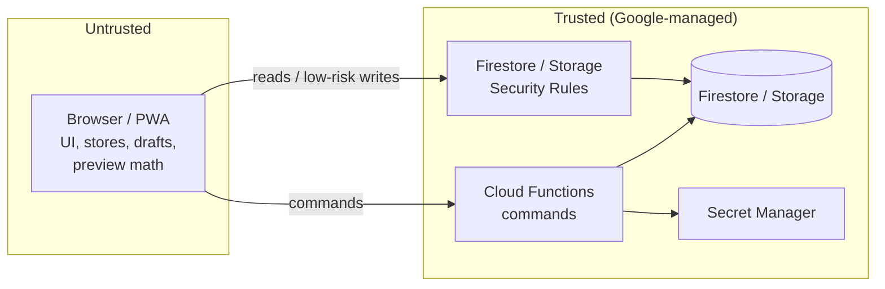

# Security Architecture

> **Phase 0 deliverable.** Security design for the rebuild. It closes the legacy gaps documented in TD §3.2.1 and §9 (whole-document write path, app-layer-only location/tab restrictions, client-authoritative numbering/stock/accounting, fail-open home location) while preserving the legacy access concepts (active membership, owner/admin vs shop, per-account tab grants, home location, admin-only deletes, immutable stock movements).

---

## 1. Threat model

| Actor | Capability | Main risks |
|---|---|---|
| Anonymous internet user | Has the public Firebase web config (it is always public) | reading or writing data directly, abusing callables |
| Authenticated non-member | Valid Firebase account, no membership | reading any business's data |
| Restricted shop member | Legit credentials, a restricted role and location | bypassing restrictions through the direct API (legacy KL-05), editing other shops' data, forging totals, tax or stock |
| Admin member | Broad rights | mistakes (destructive restore or reset); a compromised account |
| Lost or stolen device | Persistent session and local cache | data exposure on a shared or lost device |
| Malicious script | XSS, supply-chain script | token theft |

**Security goal:** a request is honored only if the **server** verifies all of these: an authenticated user, a genuine app (App Check), an active membership in the target business, the permission, the location, valid input, a recent enough re-authentication (where required) and business invariants.

## 2. Trust boundaries



Nothing the client computes is trusted: totals, tax, numbers, stock and statuses are always recomputed on the server.

## 3. Authentication

- Firebase Authentication, email/password (legacy parity). There is no public sign-up: account creation is blocked for self-registration with an Identity Platform blocking function (`beforeUserCreated` rejects unless an invitation exists), or disabled in the console, depending on OQ-02.
- Password policy is enforced through the Identity Platform password policy (minimum 10 characters). The exact policy is a Phase 1 configuration item.
- **30-day re-authentication (BR-PRM-08):** the client enforces it on session restore, **and** every callable checks `request.auth.token.auth_time`. A token whose `auth_time` is older than 30 days is rejected with `REAUTH_REQUIRED`. For Firestore reads, rules check `request.auth.token.auth_time > request.time - duration.value(30, 'd')`. This closes the legacy app-only check.
- **Sensitive operations** (restore, reset, numbering changes, member management, backup download) require `auth_time` within the last **5 minutes** (a step-up re-authentication dialog).
- Deactivating a member triggers `revokeRefreshTokens(uid)`. Rules also check `active`, so access stops at the next request.
- Sign-out clears the session store, drafts, the persistent Firestore cache (`clearIndexedDbPersistence` after `terminate`) and in-memory data.

## 4. Business isolation and membership

- All data is under `businesses/{businessId}`. Rules compute `isMember(businessId)` from `businesses/{businessId}/members/{request.auth.uid}` and require `active == true`.
- Every document stores `businessId`. Rules assert that `request.resource.data.businessId == businessId` on the direct writes that are allowed.
- Functions resolve the business from the payload, load the member document **inside** the command, and never trust business or role claims sent by the client.
- Custom claims are **not** used for authorization in Phase 1 (they go stale). They may be added later only as a cache, with the member document still authoritative.

## 5. Permission model

### 5.1 Permissions

Defined once in `packages/domain/src/permissions.ts` and used by rules generation, functions and UI.

```
dashboard.view
sales.view  sales.create  sales.edit  sales.delete
quotations.view  quotations.manage
deliveryNotes.view  deliveryNotes.manage
creditNotes.manage  debitNotes.manage
customers.view  customers.manage  customers.delete
suppliers.view  suppliers.manage  suppliers.delete
products.view  products.manage  products.delete  barcodes.print
stock.view  stock.adjust  stock.count  stock.transfer  reorder.view
stock.overrideNegative        credit.overrideLimit
purchases.view  purchases.manage  purchases.delete
payments.record  dues.view
accounting.view  accounts.manage
cashbook.view  cashbook.manage
expenses.view  expenses.manage
gst.view
payroll.view  payroll.manage
reports.view  shopComparison.view  activity.view
settings.manage  numbering.manage  members.manage  locations.manage
backup.create  restore.execute  data.reset
```

### 5.2 Role → permissions (legacy-parity defaults)

| Role | Permissions | Source |
|---|---|---|
| `owner` | all | TD §2.4 (`isAdmin`) |
| `admin` | all | TD §2.4 (`isAdmin`). Narrowing `restore.execute`/`data.reset` to the owner only is OQ-02. |
| `shop` | the default shop set (below), **plus** `permissionOverrides` from the member document (legacy `tabs`) | TD §2.4 |
| `manager`, `accountant`, `staff` | **NOT DEFINED in legacy.** No permissions until OQ-02 is decided. The model supports them with no code change. | — |

**Default shop set** (provisional; the exact legacy `DEFAULT_SHOP_TABS` list is OQ-10). It is limited to "day-to-day billing/stock work":
`dashboard.view, sales.view, sales.create, sales.edit, quotations.*, deliveryNotes.*, customers.view, customers.manage, products.view, barcodes.print, stock.view, stock.adjust, stock.count, stock.transfer, reorder.view, stock.overrideNegative, credit.overrideLimit`.

**Hard exclusions for every non-admin role, even with overrides** (BR-PRM-03): `settings.manage, numbering.manage, members.manage, locations.manage, backup.create, restore.execute, data.reset`.

**Never in the default shop set** (BR-PRM-04), but grantable by override: `accounting.*, accounts.manage, cashbook.*, expenses.*, dues.view, gst.view`.

**Admin-only deletes** (BR-PRM-05): `sales.delete, customers.delete, suppliers.delete, products.delete` are held only by owner/admin, and overrides can't grant them to `shop`. This preserves the legacy cloud rule.

Resolution: `can(member, perm) = !hardExcluded(member.role, perm) && (rolePerms(member.role).has(perm) || member.permissionOverrides?.[perm] === true) && member.permissionOverrides?.[perm] !== false`.

## 6. Location restrictions

- `member.locationIds`: `null` means all locations (owner/admin default). A non-empty array means restricted to those. An empty array means **no** location access (fail closed). This fixes legacy LC-6.3, where a name mismatch left the account unrestricted.
- **Commands:** every location-bound command runs `requireLocation(actor, locationId)` against the document's (or draft's) `locationId`. Transfers require the **source** location. Destination rules are OQ-24.
- **Rules (reads):** location-scoped collections (`invoices`, `deliveryNotes`, `quotations`, `creditNotes`, `purchases`, `payments`, `expenses`, `cashEntries`, `payrollEntries`, `stockLevels`, `stockMovements`, `stockCounts`) allow a read only if `canAccessLocation(resource.data.locationId)`. Restricted clients must query with `where('locationId', 'in', allowed)`. Rules are not filters.
- **Cross-location aggregates** that legacy shows to everyone (Dashboard all-location sales and dues, BR-RPT-01/02) are served by a callable that returns **only totals**, so a restricted member can see the legacy KPI without reading other shops' documents. Whether restricted users should see them at all is OQ-23.
- Editing a document from another location is refused by the server (BR-INV-10), matching the legacy UI lock.

## 7. Firestore Security Rules design

Principles:
1. **Default deny.** `match /{document=**} { allow read, write: if false; }`
2. **Server-owned collections: `allow write: if false`.** Only the Admin SDK in functions writes them. This covers counters, documentNumbers, stockLevels, stockMovements, invoices, quotations, deliveryNotes, creditNotes, debitNotes, purchases, payments, journalEntries, ledgerMonthly, salesDaily, accounts, expenseCategories, expenses, cashEntries, payrollEntries, staffPayments, activityLog, backups, restoreJobs, idempotency, barcodes, stockTransfers, stockCounts, members (all member writes go through callables), settings.
3. **Direct client writes** are allowed only for low-risk master data: `customers`, `suppliers` (create/update, not delete), `staff` (create/update), `whatsappCampaigns`. They must pass the permission check, a field whitelist (`keys().hasOnly`), types and lengths, `businessId` match, `createdBy/updatedBy == auth.uid`, `updatedAt == request.time`, and must not touch server-owned fields (`stats`, `deletedAt`).
4. **Stock movements are never updated or deleted by anyone** (BR-PRM-06). Functions never update them either (enforced in code review and tests).
5. There is **no shared whole-business document** (closes legacy KL-04).

Sketch (the full rules are generated and tested in Phase 1):

```
rules_version = '2';
service cloud.firestore {
  match /databases/{db}/documents {
    function signedIn() { return request.auth != null
        && request.auth.token.auth_time > (request.time.toMillis() / 1000) - 30*24*3600; }
    function member(b) { return get(/databases/$(db)/documents/businesses/$(b)/members/$(request.auth.uid)).data; }
    function isMember(b) { return signedIn()
        && exists(/databases/$(db)/documents/businesses/$(b)/members/$(request.auth.uid))
        && member(b).active == true; }
    function isAdmin(b) { return isMember(b) && member(b).role in ['owner','admin']; }
    function canLoc(b, loc) { return isAdmin(b) || member(b).locationIds == null || loc in member(b).locationIds; }
    function ovr(b, perm) { return member(b).permissionOverrides == null ? null
        : member(b).permissionOverrides.get(perm, null); }
    // generated from packages/domain/permissions (single source); shown for shop role
    function has(b, perm) { return isAdmin(b) || (
        !(perm in hardExcludedForNonAdmin())
        && (ovr(b, perm) == true || (perm in shopDefaults() && ovr(b, perm) != false))); }

    match /users/{uid} {
      allow read: if signedIn() && request.auth.uid == uid;
      allow update: if signedIn() && request.auth.uid == uid
        && request.resource.data.diff(resource.data).affectedKeys().hasOnly(['preferences','defaultBusinessId','updatedAt']);
    }

    match /businesses/{b} {
      allow read: if isMember(b);
      match /members/{uid} { allow read: if isMember(b) && (request.auth.uid == uid || has(b,'members.manage')); allow write: if false; }
      match /settings/{doc} { allow read: if isMember(b); allow write: if false; }
      match /locations/{id} { allow read: if isMember(b); allow write: if false; }
      match /products/{id}  { allow read: if isMember(b) && has(b,'products.view'); allow write: if false; }
      match /stockLevels/{id} { allow read: if isMember(b) && has(b,'stock.view') && canLoc(b, resource.data.locationId); allow write: if false; }
      match /stockMovements/{id} { allow read: if isMember(b) && has(b,'stock.view') && canLoc(b, resource.data.locationId); allow write: if false; }
      match /invoices/{id} { allow read: if isMember(b) && has(b,'sales.view') && canLoc(b, resource.data.locationId); allow write: if false; }
      match /customers/{id} {
        allow read: if isMember(b) && has(b,'customers.view');
        allow create, update: if isMember(b) && has(b,'customers.manage') && validCustomer(b);
        allow delete: if false;                 // soft delete via callable (admin only)
      }
      match /journalEntries/{id} { allow read: if isMember(b) && has(b,'accounting.view'); allow write: if false; }
      match /activityLog/{id} { allow read: if isMember(b) && has(b,'activity.view'); allow write: if false; }
      // … every other collection explicitly listed; unknown paths fall to default deny
    }
  }
}
```

Rule cost: each rule evaluation performs at most 1–2 `get()` calls on the member doc (cached per request). This is acceptable.

## 8. Storage Security Rules

```
service firebase.storage {
  match /b/{bucket}/o {
    function member(b) { return firestore.get(/databases/(default)/documents/businesses/$(b)/members/$(request.auth.uid)).data; }
    function isMember(b) { return request.auth != null && member(b).active == true; }
    match /businesses/{b}/branding/{file} {
      allow read: if isMember(b);
      allow write: if false;                    // via settings.uploadLogo (signed upload + server validation)
    }
    match /businesses/{b}/products/{productId}/{file} {
      allow read: if isMember(b);
      allow create: if isMember(b) && member(b).role in ['owner','admin','shop']   // refined by products.manage
                    && request.resource.size < 1 * 1024 * 1024
                    && request.resource.contentType == 'image/jpeg';
      allow update, delete: if false;           // replace/delete via products.setImage
    }
    match /businesses/{b}/backups/{file} { allow read, write: if false; }   // download via short-lived signed URL from callable
    match /{all=**} { allow read, write: if false; }
  }
}
```
Client-side compression (DEF-061/062) is preserved. The server validates type and size.

## 9. Secrets

- The WhatsApp API key (LC-2.5) and any future integration secret are stored in **Google Secret Manager** and written by a callable (`settings.updateIntegrations`). The client only ever sees `hasApiKey: true/false`. Legacy stored the key in client-readable settings; this is a **[FIX]**.
- The Firebase web config is public by design. It is injected from build-time env (`VITE_FIREBASE_*`), not hardcoded (unlike legacy `hh-erp-2026`).
- CI uses Workload Identity Federation, so there are no service-account keys in GitHub secrets.

## 10. App Check

- Web provider: **reCAPTCHA Enterprise** (invisible). Debug tokens for emulators and CI only.
- Enforced on Cloud Functions (`enforceAppCheck: true`), Firestore and Storage, after a monitoring period in staging.
- Replay protection (`consumeAppCheckToken`) on money/stock commands.
- App Check is a defense-in-depth layer, never a replacement for auth and rules.

## 11. Server-side validation in commands

Each command (ARCHITECTURE §6.3):
1. App Check + auth + re-auth age.
2. Load member → `active`.
3. `requirePermission(perm)`.
4. `requireLocation(locationId)`.
5. Zod-parse the payload (reject unknown keys, bound string lengths, bound array sizes such as 500 lines).
6. Load referenced entities **inside the transaction** (products, customer, source docs) and verify they belong to the same business, aren't deleted and are in the right state (for example, only a `pending` DN can be converted).
7. Compute with `packages/domain`. Never accept client totals. The only client-supplied line values accepted are the ones that are business inputs: `qty`, `ratePaise`, `discountBp`, `gstRateBp` (snapshot, must be in the allowed list) and `unit`.
8. Enforce confirmation flags for warning-level rules.
9. Write everything in one transaction, including the activity log.

## 12. Audit

- `activityLog` is written by functions only, immutable, and includes `actorUid`, `requestId`, before/after summaries for edits and deletes, and the location.
- Financial reversals keep voided journal entries (BR-ACC-05) and soft-deleted documents, so history can always be reconstructed.
- Every restore, reset, numbering change, member change and backup download is logged with the step-up re-authentication time.

## 13. Backup and restore security

- `backup.create` requires `backup.create` permission and recent re-authentication. The file is generated server-side into `businesses/{b}/backups/`. The download is a signed URL valid for 5 minutes.
- `restore.prepare` validates the uploaded file: size limit, JSON schema, `businessId` match (or explicit cross-business confirmation, OQ-20), `schemaVersion` transform path, and checksum. It produces a dry-run summary.
- `restore.execute` requires `restore.execute`, step-up re-authentication, a typed confirmation phrase and an automatic pre-restore backup. It runs as a resumable server job, and is audited.
- Backups contain PII and financial data. The Storage path is server-only, and downloads are logged.

## 14. Data protection on devices

- Firestore persistent cache is **off by default** (memory cache). It is opt-in per device as a "trusted device" setting (OQ-04). When on, sign-out clears it.
- Drafts persisted locally contain only draft intent (products, qty, customer id). They are cleared on sign-out.
- The service worker **never** caches Firestore, Auth, Functions or Storage responses (PWA §5).
- An inactivity lock (auto sign-out or re-prompt) for shared shop devices is **not** in legacy. It is not added without a decision.

## 15. Web hardening

- Content Security Policy via Hosting headers: `default-src 'self'`, `script-src 'self'` plus reCAPTCHA origins, `connect-src` limited to Firebase/Google APIs, `img-src 'self' data: blob: https://firebasestorage.googleapis.com`, `frame-ancestors 'none'`.
- No `dangerouslySetInnerHTML` (legacy used `innerHTML` everywhere). React escapes by default, and an ESLint rule forbids the escape hatch.
- `Strict-Transport-Security`, `X-Content-Type-Options: nosniff`, `Referrer-Policy: strict-origin-when-cross-origin`, `Permissions-Policy: camera=(self)` (camera is needed for barcode scanning).
- Dependabot and `npm audit` run in CI. The lockfile is committed.

## 16. Abuse and rate limiting

- Per-uid token bucket in functions for expensive callables (reports, backup, restore): for example, 30 report calls per minute per user.
- App Check limits bot traffic.
- Every list query in repositories uses `limit()`, so there are no unbounded reads.

## 17. Legacy gaps closed

| Legacy gap | Closed by |
|---|---|
| `data/main` writable by any member, bypassing per-record rules | no shared document; server-only collections |
| Location and tab restrictions app-layer only | rules + `requireLocation`/`requirePermission` in functions |
| Home location fail-open on name mismatch | id references, fail closed |
| Client-side invoice counters | server transactions + reservations |
| Client-authoritative stock and accounting | server-only writes |
| Re-auth checked on the client only | `auth_time` checked in rules and functions |
| API keys in client-readable settings | Secret Manager |
| Rules pasted by hand from a Settings panel | CI-deployed, emulator-tested rules |
| Service worker intercepting Firebase calls (fixed in legacy v2.85.0) | same-origin-only SW policy preserved |

## 18. Security testing

- Rules test matrix: every role (owner, admin, shop, shop-with-overrides, inactive, non-member, anonymous) × every collection × read/create/update/delete × own location / other location. It must be green before any deploy.
- Function tests: forged totals ignored, forged `locationId` rejected, restricted member at another location rejected, inactive member rejected, stale `auth_time` rejected, duplicate `requestId` returns the original result, and concurrent creates produce unique numbers.
- Pre-release: an OWASP ASVS L2 checklist review of auth, session and access-control items.

---

## 19. Phase 2 implementation status

This section records what the security foundation actually ships as of Phase 2. The design
above is the target; the items below are implemented, tested and in the repository.

### 19.1 What is implemented

| Area | Where | Verified by |
|---|---|---|
| Permission model (6 roles, overrides, hard exclusions) | `packages/domain/src/permissions.ts` | `permissions.test.ts`, `docs/PERMISSIONS.md` (generated) |
| Firestore rules (deny-by-default, membership, permission, location, server-only writes) | `firestore.rules` | `tests/rules/firestore.test.ts` (20 cases) |
| Storage rules (business isolation, member gate, image type/size) | `storage.rules` | `tests/rules/storage.test.ts` (10 cases) |
| Client auth state machine (loading/configError/signedOut/unauthorized/inactive/ready) | `apps/web/src/stores/auth-store.ts` | `auth-store.test.ts` |
| Login screen (RHF + Zod, friendly errors) | `apps/web/src/features/auth/` | E2E against Auth emulator |
| Server authorization guards (auth → active → permission → location → step-up → owner-protection → self-guard) | `functions/src/auth/authorize.ts` | `functions/src/auth/authorize.test.ts` (11 cases) |
| Member-management callables (create/update/setActive) | `functions/src/members/manage.ts` | guards unit-tested; rules deny direct writes |
| Session/audit callable + membership triggers (token revocation, businessIds sync) | `functions/src/auth/session.ts`, `functions/src/members/triggers.ts` | — |
| App Check client init (reCAPTCHA Enterprise; debug token dev-only) | `apps/web/src/lib/firebase/app-check.ts` | — |

### 19.2 Environment separation (Phase 2 §38)

- Three Firebase projects, configured in `.firebaserc`: `hynish-dev` (default), `hynish-staging`,
  `hynish-prod`. The web app reads its config from build-time `VITE_FIREBASE_*` env (never
  hard-coded), and the business it serves from `VITE_BUSINESS_ID`.
- The **emulator** demo project id is `demo-hynish` (no real credentials, offline-safe).
- Firestore/Functions region: `asia-south1` (OQ-15).

### 19.3 App Check (Phase 2 §34)

- Web provider: **reCAPTCHA Enterprise**, site key from `VITE_APPCHECK_SITE_KEY`.
- Debug tokens come only from `VITE_APPCHECK_DEBUG_TOKEN` in a **DEV** build and are wired to
  `globalThis.FIREBASE_APPCHECK_DEBUG_TOKEN`; a production build cannot ship one.
- App Check is **bypassed against local emulators** and **enforced on callables in production**
  (`enforceAppCheck` is off only when `FUNCTIONS_EMULATOR === 'true'`).
- App Check is defense-in-depth; auth + rules remain authoritative.

### 19.4 Emulator strategy (Phase 2 §39)

- `firebase.json` configures the Auth (9099), Firestore (8080), Functions (5001), Storage (9199)
  and UI (4000) emulators, single-project mode.
- `npm run emulators` starts them; `npm run test:rules` runs the rule test suites via
  `firebase emulators:exec --only firestore,storage`.
- The web client auto-connects to emulators when `VITE_USE_FIREBASE_EMULATORS=true`
  (`connectAuthEmulator`, `connectFirestoreEmulator`, `connectFunctionsEmulator`,
  `connectStorageEmulator`).

### 19.5 Deliberate legacy-gap fixes confirmed in tests

- No shared `data/main` document — closed. Each collection has explicit rules.
- Location/permission restrictions are enforced by rules **and** functions, not app-layer only
  (KL-05) — proven by the location-denial and cross-business tests.
- Member documents are **not** client-writable, so nobody can self-escalate role/permissions/
  active — proven by the membership-protection tests.
- The 30-day reauth window is enforced in rules (`auth_time`) and in `resolveActor` — proven by
  the stale-session test.

### 19.6 Known items deferred to later phases

- Business-operation callables (invoices, payments, stock, journal) and their transaction/
  idempotency machinery — Phase 3+.
- Production CSP header tuning (`firebase.json` currently sets `X-Content-Type-Options`,
  `Referrer-Policy`, `X-Frame-Options`, `Permissions-Policy`, `HSTS`; a full `Content-Security-Policy`
  is validated against Firebase/reCAPTCHA origins before enforcement — Phase 2 §52).
- Persistent Firestore cache "trusted device" toggle (§14) — not enabled yet (memory cache only).
- Automated deploy pipeline (Workload Identity Federation) — infra phase.
